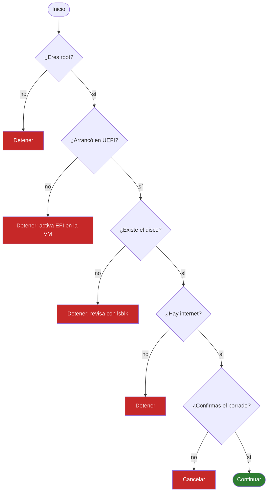
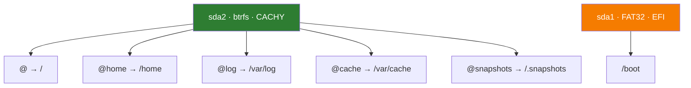
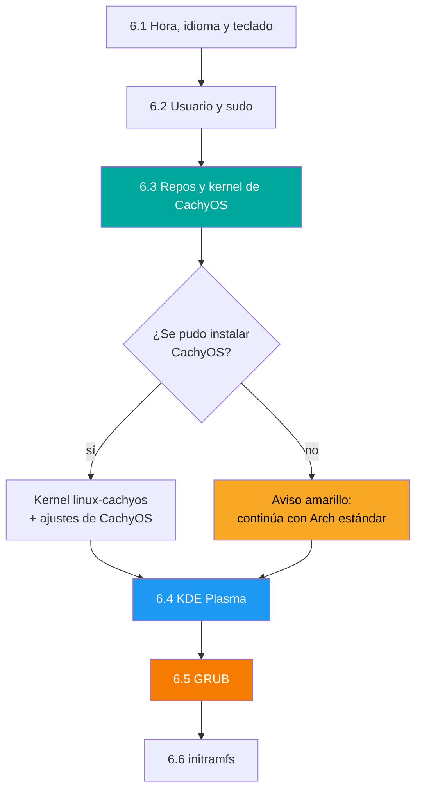
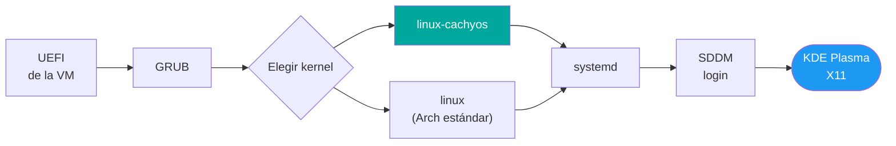

<div align="center">

# cachy-custom-installer

**Instalación automatizada de un Arch Linux personalizado al estilo CachyOS,**
**con btrfs, KDE Plasma y kernel de CachyOS, en un solo script de Bash.**


</div>

---

## ¿Qué hace este script?

`install.sh` toma un disco vacío y, sin intervención manual, deja instalado un sistema completo:
particiona, formatea, instala Arch Linux, agrega los repositorios y el kernel de CachyOS, configura el
escritorio KDE Plasma y deja el arranque listo. Solo pide una confirmación antes de borrar el disco.


| | |
|---|---|
| **Base** | Arch Linux instalado con `pacstrap` |
| **Identidad CachyOS** | Repos, kernel `linux-cachyos`, ajustes del sistema y de KDE, `fish` y `paru` |
| **Disco** | GPT, partición EFI + partición btrfs con 5 subvolúmenes y compresión zstd |
| **Escritorio** | KDE Plasma (sesión X11), SDDM y utilidades de VirtualBox |
| **Arranque** | UEFI con GRUB, dos kernels disponibles (CachyOS y Arch estándar) |

---

## Antes de empezar

### Máquina virtual

| Ajuste | Valor |
|---|---|
| Tipo / versión | Linux / Arch Linux (64-bit) |
| Memoria | 4 GB o más (recomendado 6 GB) |
| CPU | 2 a 4 núcleos |
| Disco | 25 GB o más, VDI dinámico |
| **Habilitar EFI** | **Sí (obligatorio)** |
| Gráficos | VMSVGA con 128 MB de VRAM |
| Red | NAT |
| Unidad óptica | ISO oficial de Arch Linux |

> [!IMPORTANT]
> Toma un **snapshot** de la VM apagada antes de instalar. Así puedes repetir la prueba sin recrearla.

### Ejecutarlo

Desde la ISO en vivo de Arch, que arranca como `root`:

```bash
loadkeys la-latin1
curl -fsSLO https://raw.githubusercontent.com/Icebreaker26/cachy-custom-installer/main/install.sh
bash install.sh
```

> [!WARNING]
> El script **borra todo el disco** indicado en `DISCO` (por defecto `/dev/sda`). Úsalo solo en una VM o en un disco de pruebas.

---

## Paso a paso

Cada etapa muestra un encabezado azul `══> N/7 ...` y una marca verde `✔` al terminar. Si algo falla, el
script se detiene con un mensaje rojo que indica la línea del error.

### 1 · Verificaciones

Antes de tocar nada, el script comprueba cuatro cosas:



También activa la sincronización de hora (`timedatectl set-ntp true`) y muestra el disco con `lsblk`.

### 2 · Particionado (GPT)

Borra las firmas anteriores (`wipefs`, `sgdisk -Z`) y crea dos particiones con `sgdisk`:

```text
/dev/sda  (tabla GPT)
+----------------------+--------------------------------------------------+
| sda1 · 512 MiB       | sda2 · resto del disco                           |
| EFI · FAT32 · ef00   | Raíz · btrfs · 8300                              |
| se monta en /boot    | 5 subvolúmenes (ver etapa 3)                     |
+----------------------+--------------------------------------------------+
```

El script detecta si el disco termina en número (por ejemplo `/dev/nvme0n1`) y usa el sufijo `p1`, `p2`.

### 3 · Formato y montaje con btrfs

Formatea la EFI como FAT32 y la raíz como **btrfs**. En btrfs crea **5 subvolúmenes**, que son carpetas
independientes dentro del mismo sistema de archivos:



Todos se montan con `noatime,compress=zstd:3,ssd,discard=async`:

| Opción | Para qué sirve |
|---|---|
| `compress=zstd:3` | Comprime los datos al escribir y ahorra espacio |
| `noatime` | No registra la hora de cada lectura, así se escribe menos |
| `ssd`, `discard=async` | Optimiza el trabajo con discos SSD |

Separar `/home`, los logs y los snapshots permite, por ejemplo, restaurar el sistema sin perder los datos
de los usuarios.

### 4 · Sistema base (`pacstrap`)

Instala el sistema mínimo en `/mnt`:

| Paquetes | Función |
|---|---|
| `base`, `linux`, `linux-firmware` | Sistema y kernel estándar de Arch |
| `base-devel`, `git`, `sudo` | Herramientas de compilación y administración |
| `nano`, `vim`, `bash-completion` | Editores y autocompletado |
| `networkmanager` | Red |
| `grub`, `efibootmgr` | Cargador de arranque |
| `btrfs-progs` | Herramientas de btrfs |

Antes de instalar, el script desactiva el límite de tiempo de descarga de `pacman` y reduce a 3 las
descargas paralelas. Si falla, **reintenta hasta 5 veces**.

### 5 · Tabla de montaje

`genfstab -U /mnt` genera `/etc/fstab` con los identificadores (UUID) de cada partición y subvolumen, y lo
muestra en pantalla.

### 6 · Configuración dentro del sistema (`chroot`)

El script se copia a `/mnt/root/`, guarda las variables en `vars.env` y se vuelve a ejecutar dentro del
sistema nuevo con `arch-chroot`. Aquí ocurre la mayor parte de la personalización:



| Sub-etapa | Qué hace |
|---|---|
| **6.1** | Zona horaria `America/Bogota`, idioma `es_CO.UTF-8`, teclado de consola `la-latin1`, nombre del equipo y `/etc/hosts` |
| **6.2** | Contraseña de root, usuario en el grupo `wheel` y `sudo` habilitado para ese grupo |
| **6.3** | Descarga y ejecuta el script oficial de repos de CachyOS y luego instala `linux-cachyos`, sus ajustes, `fish` y `paru`. **Si falla, no detiene la instalación** |
| **6.4** | Instala KDE Plasma con sesión X11, SDDM, Konsole, Dolphin, Kate, Firefox y audio con PipeWire. Activa los servicios, configura el inicio de sesión automático y el teclado latinoamericano en X11 |
| **6.5** | Instala GRUB en modo UEFI (`--removable`, para que arranque en el EFI de VirtualBox) y genera su menú |
| **6.6** | Regenera los `initramfs` de todos los kernels con `mkinitcpio -P` |

> [!NOTE]
> Los paquetes de KDE se instalan **después** de agregar los repos de CachyOS, así que varios provienen de
> sus repositorios optimizados (`x86_64_v3`). Esta etapa es la más larga.

### 7 · Final

Desmonta todo con `umount -R /mnt`, avisa que la instalación terminó y ofrece reiniciar. **Antes de que
arranque el sistema nuevo hay que quitar la ISO** (Dispositivos → Unidades ópticas → Quitar disco).

---

## Cómo arranca el sistema instalado



En el menú de GRUB las dos entradas llevan el mismo nombre, porque GRUB usa el de la distribución. Se
distinguen dentro de **Advanced options**. Ya dentro del sistema, este comando confirma qué kernel corre:

```bash
uname -r
```

Si el resultado contiene `cachyos`, se está usando el kernel de CachyOS.

---

## Qué queda instalado

| Componente | Detalle |
|---|---|
| Kernels | `linux-cachyos` y `linux` (Arch), ambos en GRUB |
| Escritorio | KDE Plasma en X11, con SDDM |
| Shell del usuario | `fish` (si se instalaron los paquetes de CachyOS) |
| Gestor de paquetes | `pacman`, `paru` para AUR |
| Red | NetworkManager |
| Audio | PipeWire con WirePlumber |
| VirtualBox | `virtualbox-guest-utils`, con servicio `vboxservice` |
| Usuario | `alejandro` (grupo `wheel`, con `sudo`) |
| Idioma y teclado | `es_CO.UTF-8` y teclado latinoamericano |

---

## Configuración

Todas las variables están al inicio de `install.sh` y se pueden cambiar desde la línea de comandos:

```bash
DISCO=/dev/nvme0n1 USUARIO=maria AUTOLOGIN=no bash install.sh
```

| Variable | Por defecto | Descripción |
|---|---|---|
| `DISCO` | `/dev/sda` | Disco que se borra e instala |
| `HOSTNAME_NUEVO` | `cachy-custom` | Nombre del equipo |
| `USUARIO` | `alejandro` | Usuario que se crea |
| `PASS_USUARIO` | `cachy123` | Contraseña del usuario (**cámbiala**) |
| `PASS_ROOT` | `root123` | Contraseña de root (**cámbiala**) |
| `ZONA_HORARIA` | `America/Bogota` | Zona horaria |
| `LOCALE` | `es_CO.UTF-8` | Idioma del sistema |
| `KEYMAP` | `la-latin1` | Teclado de la consola |
| `XKB_LAYOUT` | `latam` | Teclado en KDE (X11) |
| `INSTALAR_CACHYOS` | `si` | Agrega repos, kernel y ajustes de CachyOS |
| `AUTOLOGIN` | `si` | Entra directo al escritorio |
| `ASSUME_YES` | `no` | `si` omite la confirmación de borrado |
| `RESUME` | `no` | `si` retoma en el chroot con `/mnt` ya montado |

---

## Resistencia a fallos

| Mecanismo | Qué hace |
|---|---|
| `set -Eeuo pipefail` | Detiene el script ante cualquier error |
| Mensaje de error | Muestra la línea que falló |
| Reintentos | `pacstrap`, el kernel de CachyOS y KDE se reintentan hasta 5 veces |
| Sin timeout de descarga | Evita cortes por redes lentas |
| `install.log` | Guarda toda la salida en el directorio donde se ejecutó |
| `RESUME=si` | Salta las etapas 1 a 5 y retoma en el chroot si el sistema base ya está montado |
| CachyOS opcional | Si sus repos fallan, la instalación sigue con Arch estándar |

Para retomar tras un fallo, sin reiniciar la VM:

```bash
RESUME=si bash install.sh
```

---

## Problemas frecuentes

| Síntoma | Causa y solución |
|---|---|
| `No arrancó en UEFI` | Activa **Habilitar EFI** en Configuración → Sistema de la VM |
| `Sin internet` | La red de la VM debe estar en NAT |
| `No existe el disco` | Revisa el nombre real con `lsblk` y pásalo con `DISCO=...` |
| Se queda en `Retrieving packages...` | Descarga lenta o mirror caído. Cancela con `Ctrl+C` y ejecuta `RESUME=si bash install.sh` |
| Aviso amarillo de CachyOS | Los repos no se pudieron agregar. El sistema arranca con el kernel de Arch |
| La VM vuelve a arrancar la ISO | Quita la ISO en Dispositivos → Unidades ópticas |
| Símbolos raros al escribir en KDE | Teclado en inglés. Ejecuta `sudo localectl set-x11-keymap latam` |

---

## Estructura del repositorio

```text
cachy-custom-installer/
├── install.sh        el instalador
├── README.md         este documento
├── .gitattributes    fuerza saltos de línea LF en los .sh
└── .gitignore        excluye install.log
```

## Aviso

Proyecto con fines educativos. Las contraseñas por defecto son de ejemplo y deben cambiarse en cualquier
uso real. Está pensado para VirtualBox con la ISO oficial de Arch Linux.
